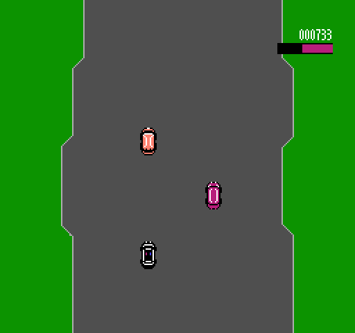

# The Getaway
An NES game using mapper 218. The cartridge has no on-board CHR, so all tile data is stored on the PPU memory instead. The Getaway is a scrolling car shooter that keeps the CHR data always just barely offscreen.

# Building
To build the ROM, download [js65](https://jsnesx.github.io/js65/download/), add it to your path, then enter `js65 build` in the root directory. The resulting ROM will be created at `./build/TheGetaway.nes`. On Windows, you may also use the batch script `build_and_run.bat` to build the project and immediately run it in [Mesen](https://www.mesen.ca/) as well.
